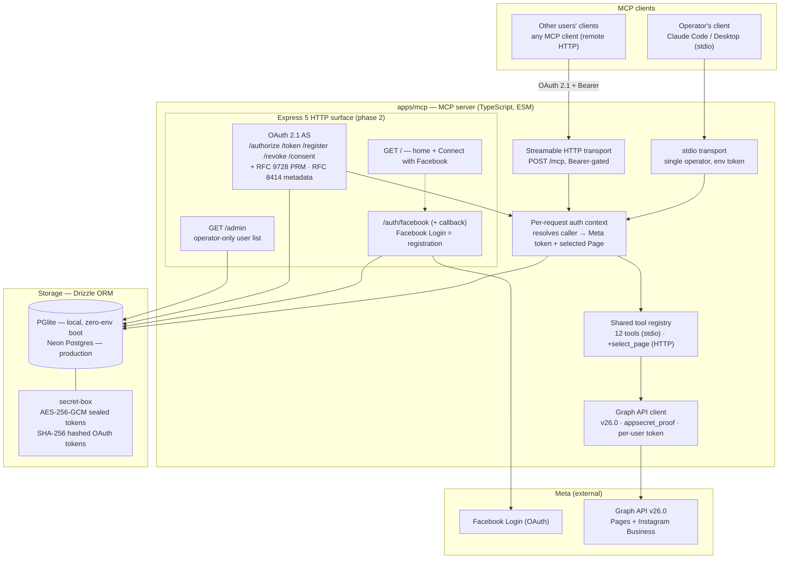
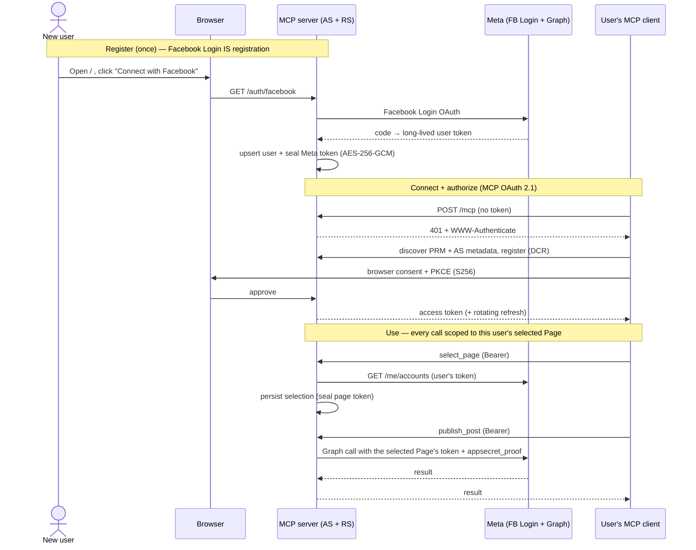

# Architecture

How Social MCP is put together as of the phase-1 + phase-2 build (`apps/mcp`). One
TypeScript server exposes the same tool catalog over two transports: **stdio** for the
single operator (phase 1) and **Streamable HTTP** with OAuth 2.1 for multiple users
(phase 2). All tooling acts on **Facebook Pages + linked Instagram Business** accounts
via the Meta Graph API — never personal profiles.

## System diagram

Solid arrows are request/data flow; the dotted arrow is a page link. Both transports feed
the **same** tool registry — the auth context is what differs: stdio's context is backed
by the operator's `META_ACCESS_TOKEN` env var, HTTP's is backed by the authenticated
user's stored token and selected Page.

## Why one server, not one per platform

A natural instinct is to split this into separate servers — one for the Facebook Page, one
for Reels, one for the linked Instagram account. **Don't.** They are facets of a single
Meta Graph surface behind one Meta app, one login, and one token per user — not three
services. Splitting them triples the setup for zero benefit and breaks the features that
span them.

- **Reels are not a separate platform — they are a publishing format on the Page.** A Reel
  publishes to `POST /{page-id}/video_reels` using the *same* Page access token and the
  *same* `pages_manage_posts` permission as an ordinary post. There is no separate Reels
  API to authenticate against, so a "Reels server" would own no credential and no endpoint
  of its own.
- **The linked Instagram account is reached *through* the Page.** It is the
  `instagram_business_account` attached to the Page. Publishing goes to the same Graph API
  under the same Meta app, and the user grants the Instagram permissions in the *same*
  Facebook Login consent. One OAuth flow, one stored token context, covers both surfaces.
- **One app · one login · one token.** Because all three ride the same Meta app and the
  same per-user token, three servers would mean three OAuth flows, three client
  registrations in the MCP client (Hermes), and three token stores — for a single
  credential.
- **Cross-posting would break.** `cross_post` republishes content between the Page and its
  linked Instagram account in one call. Across three servers that becomes cross-*server*
  coordination — the one feature that most wants a shared context loses it.

The separation that *is* real lives at the **tool** layer, not the server layer, and is
already there: `publish_post` (Page), `publish_reel` (Reel), `publish_instagram` (linked
Instagram account), `cross_post`, plus per-surface Insights and comment tools. One server,
one tool per job. See [`product/platform.md`](product/platform.md) for the platform
primitives and the canonical terms these tools use.

## Components

| Layer | What it does | Key files |
|---|---|---|
| **Transports** | stdio (phase 1) and Streamable HTTP `POST /mcp` (phase 2), both on one registry | `src/index.ts`, `src/http/mcp-route.ts` |
| **Tool registry** | 12 tools: publish/schedule posts & reels, IG publish, cross-post, list/delete posts, insights, comment read/reply/moderate, health. `select_page` added over HTTP. | `src/tools/**` |
| **Auth context** | Per request: resolve caller → Meta token + selected Page; scope every Graph call to that Page's token. No cross-user state. | `src/tools/context.ts`, `src/http/mcp-route.ts` |
| **Graph client** | Typed fetch wrapper, pinned Graph API **v26.0**, `appsecret_proof`, Graph-error shaping, id-charset validation + path-segment encoding | `src/graph/**` |
| **OAuth 2.1 AS** | Authorization + resource server on the MCP SDK handlers: PKCE S256, RFC 9728 PRM, RFC 8414 metadata, RFC 9207 `iss`, RFC 8707 audience, DCR, refresh rotation + reuse-detection | `src/http/app.ts`, `src/http/auth/**` |
| **Facebook Login** | Onboarding/identity — registers the user and stores their long-lived Meta token (encrypted). Not the MCP authorization server. | `src/http/fb-login.ts`, `src/http/meta-oauth.ts` |
| **Admin page** | Operator-only `GET /admin` user list, gated by `ADMIN_FB_USER_IDS` allowlist | `src/http/admin.ts`, `src/db/admin.ts` |
| **Storage** | Drizzle ORM; PGlite in-memory when `DATABASE_URL` unset (zero-env boot), Neon direct in prod | `src/db/**` |
| **Crypto** | `secret-box` AES-256-GCM seals Meta/page tokens at rest; OAuth access/refresh tokens stored SHA-256-hashed | `src/secret-box.ts` |

## Multi-user flow (phase 2)

The end-to-end journey a second user takes, from registration to a tool call scoped to
their own Page:

## Data model

Drizzle tables (`src/db/schema.ts`). Credential columns are sealed or hashed — never
plaintext.

- `users` — one per registered person: internal id, `fb_user_id`, name, `created_at`.
- `meta_tokens` — sealed long-lived Meta user token, per user.
- `page_selections` — the user's chosen Page: `page_id`, `page_name`, **sealed** page
  access token.
- `oauth_clients` — MCP clients (DCR or pre-registered); client secret sealed.
- `oauth_authorization_codes` — single-use, short-TTL, PKCE challenge bound.
- `oauth_access_tokens` / `oauth_refresh_tokens` — SHA-256 hashed, audience-bound;
  refresh rotates with reuse-detection family revocation.

## Trust boundaries

- **Two separate credential domains that never substitute for each other:** the user's
  **Meta** token (what we use to call Graph on their behalf) and the **MCP** access token
  our own authorization server issues (what their client uses to call us). We never accept
  a Facebook token as an MCP bearer, and never forward our MCP token to Meta.
- **Per-user isolation:** a tool call resolves the caller from the validated Bearer token,
  then uses only that user's stored token and selected Page. `select_page` validates the
  requested Page against the caller's own `/me/accounts` (confused-deputy defense); stored
  selections are read only by the authenticated user id.
- **Admin:** `GET /admin` is gated by the `ADMIN_FB_USER_IDS` env allowlist — a signed-in
  user is admin only if their `fb_user_id` is listed; every other case returns a 404
  indistinguishable from an unmounted route. The allowlist is server-config, so admin
  status can't be self-assigned by signing in.
- **Transport hardening:** host-header validation app-wide (DNS-rebinding), Origin
  validation on `/mcp`, rate limiting on auth endpoints, strict CSP on rendered pages.

## Deployment

**Fly.io** (scale-to-zero VM) + **Neon** Postgres (direct/non-pooler connection),
migrations run out-of-band before deploy. Zero-env boot is a hard requirement: with no
env at all the server boots, stdio serves `tools/list`, and the HTTP surface serves 401 +
discovery metadata on a PGlite in-memory database. Full deploy runbook:
[`fly-deployment.md`](fly-deployment.md).

> The optional web dashboard (`apps/web`, Next.js + `@repo/ui`) — the richer review
> surface (queue, analytics, approval) — is **not built**. The operator user list is the
> `/admin` page on this server, not a separate frontend app.
